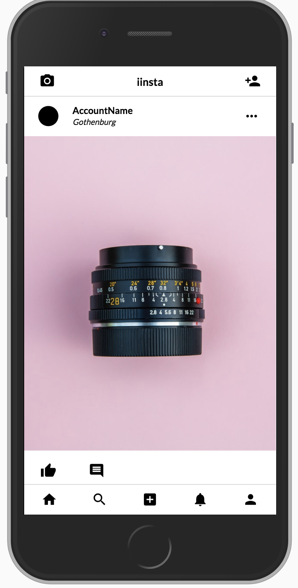

# iinsta
> Host your own Instagram in a local network or on the world wide web!

## Installing and Running the development environment
> Here is how to run the development environment, these are the requirements:

* python 2.7
* python-virtualenv
* ruby sass gem
* A running instance of MongoDB

### Setup
> First create a virtualenv:

    virtualenv -p /usr/bin/python2.7 ./venv

> Source it

    source ./venv/bin/activate

> Create the config file:

    cp config.example.json config.json

> Edit the config:

    vim config.json

> Run the setup:

    python setup.py develop

#### Transpiling the SASS to CSS
> To start watching for changes run:

    ./sass.sh

### Run
> To run the application:

    python __main__.py
